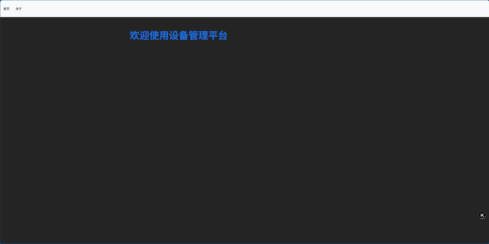

SPDX-License-Identifier: MIT

# Python_React_Vite_ESP32_AI-fault-reporting-system

## 📖 写在最前面
> 该项目框架暂时开发完成，包含全部基础的前端用户交互画面，后端数据处理，后端数据传输调用，及esp32配套数据收集硬件。
> 该项目后端暂时使用python flask框架，数据使用 json 文件配合 Python 作为简单数据库演示，前端使用react框架，数据传输使用socket。
> 该项目 esp32 程序使用arduino框架，数据上传使用http协议。
> 由于该项目中的AI部分使用外部api，而数据部分由于涉及公司数据需要在内网部署，所以该项目设计为 backend 后端API调用部分需要部署在外网计算机，或改为使用本地AI，其他部分在内网服务器部署。
> 该项目的信息收集部分（按钮盒）中的esp32需要根据对应的设备配置向后端发送的设备名称及编号，以正确的反馈维修信息。

---

## ⚙️ 介绍
> 一个基于 react 框架的前端 web 显示板，用于设备维修上位机中展示维修工单及相关信息（实现部分类似安灯系统的功能），用于展示设备维修数据，维修建议等，帮助现场工程师完成维修工作，提升工作效率。

---

## 📌 主要功能
- ✅ 功能 1：接受设备维护报修信息并在大屏展示
- ✅ 功能 2：调取报修设备对应的设备编号的最近维修记录供维修人员参考（由于设备编号设计公司管理数据，该版本项目中改为显示同名设备近期20条维修记录，正常情况下需根据设备编号进行一次数据筛选）
- ✅ 功能 3：基于同类设备维修记录，维修手册及配套维护流程，结合AI处理后返回故障预测及初步故障维修意见报告 （设计公司内部信息时建议搭建本地化RAG知识库及AI模型）

---

## 🆕 最近更新
| 日期 | 版本 | 变更摘要 |
|------|------|----------|
| 2025-07-28 | v1.1.0 | 修改替换敏感内容 |

---

## 🛠️ 技术栈
- React
- jsx
- Python flask socket
- arduino esp32 

---

## 🔗 项目结构
- 外网计算机：
   backend        用于监听esp32报修信号与外网api调用

- 内网服务器：
   data_det_api   用于提供数据集的api供backend调用并保证数据集不留存在联网设备上
   react_app      用于显示web内容，更新UI

---

### ⚙️ 硬件
- esp32c3 开发板
- 1个带LED按键
- 220v转5v type-c接口 供电模块
- 三防护套按钮盒

---

## 🚀 快速开始
1. 克隆仓库  
   ```bash
   git clone https://github.com/yijiu2333/Python_React_Vite_ESP32_AI-fault-reporting-system.git
   cd Python_React_Vite_ESP32_AI-fault-reporting-system

   ```

3. 本地启动

   前端启动（默认 port:5000）
   ```bash
   npm run dev

   ```
   或
   ```bash
   npm run build

   ```
   在服务器部署 dist 文件

   后端启动（默认 port:3001）
   ```bash
   python backend.py
   ```
   
   模拟数据启动（默认 port:3002）
   ```bash
   python json_api.py
   ```

   esp32 烧录程序后通电，按下按键后led灯亮为工作正常

4. 打开浏览器访问
    http://127.0.0.1:5000/ （默认端口）

---

## 🖼️ 程序总览
   

---

## 🚫 版权说明
   - 本项目仅供学习/作品集展示，请勿用于任何商业用途。
   - 文件中均为虚拟数据，仅用于程序功能展示，纯属虚构，不代表真实情况。

---

## 📄 许可证
   - [MIT](./LICENSE) © 2025 Yijiu233
